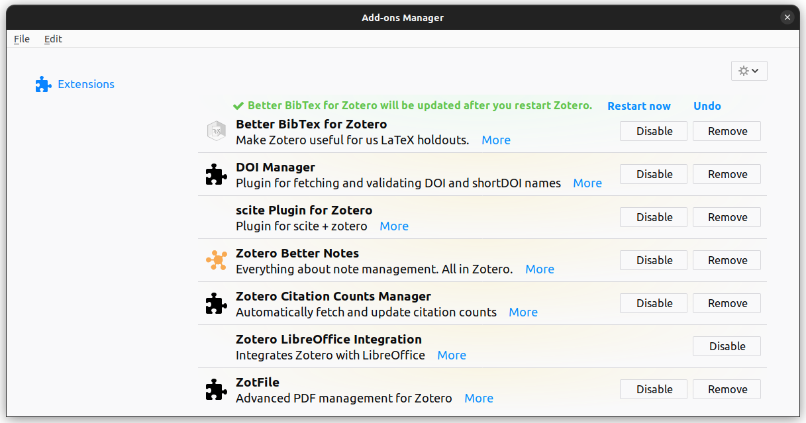

# LELEC2796's project

In this document, you will find all important information about how to work
with the provided files, and what you need to produce.

The webpage for this class is accessible here:
[LELEC2796](https://uclouvain.be/en-cours-2023-lelec2796).

The teaching assistant for this year is
[Jérome Eertmans](https://uclouvain.be/fr/repertoires/jerome.eertmans)
and can be reached via email at
[jerome.eertmans@uclouvain.be](mailto:jerome.eertmans@uclouvain.be).

## Project's structure

- First, 3 guided sessions (2 hours each);
- Then, 3 consultancy sessions;
- And, finally, one oral examination, see the [deliverables](#deliverables).

After the guided sessions, you will be asked to define a study case on
which you will work by groups. A table with ideas will be provided
to help you choose a project to work on.

For the exact schedule, see the
[Moodle page](https://moodle.uclouvain.be/course/view.php?id=1465).

## Usage

Before starting to use the project files, you will need to install some tools.

> If you have troubles installing any of the following, you can run all the
  notebooks [**online without installing anything**][jupyter-lite-url].
  Files on JupyterLite are stored in your browser's cache, **not** directly
  on your computer. Hence, you **should** therefore your notebook manually
  to keep a local copy.

This project assumes you have some basic knowledge in Python programming,
and that you have a working Python installation on your computer. You may also
use the university's computer at your disposal.

### Installing dependencies

Installing the Python modules needed for this project can be performed
with this one-liner from the terminal:

```bash
pip install -r requirements.txt
```

> Note that people using Anaconda would propably not need to install anything.

### Executing the notebooks

Finally, every project session will have its dedicated Jupyter Notebook.
You can either run Jupyter from your applications center, or using the terminal:

```bash
jupyter notebook  # or jupyter lab
```

> Make sure to run this command from the directory contaning
  this project files, or from a parent directory.

This should open a new browser tab, with a project tree containing all the file.

### How to get help

Should you encounter any problem with installing or running the programs,
please go first on
[Google](https://www.google.com/)
and look for a solution. Your teaching assistant
is also there to help, but being able to search for solutions on the Internet
is an important skill **everyone** should have ;-)

## Learning outcomes

At the end of the project, we expect you to be able to:

+ simulate a basic MIMO scenario and evaluate some performance
  metrics from it;
+ understand you model parameters and hypotheses
+ find models in the literature and criticise them;
+ and deliver reproducible results in a documented Git.

## Deliverables {#deliverables}

This project will be evaluated twice: a **mid-term**
evaluation and a **final** evaluation.

Groups can be made of 1, 2 or 3 people, depending on the
number of students taking the class this year.

### Mid-term evaluation

After the 3 guided sessions, you will be asked to define a 
study case. Once decided, you will have to book a meeting
with your teaching assistant to present and validate you can
work on your project.

During this meeting, you will also **be evaluated** on the
**3 guided sessions**. You need to bring your computer
and show that you have completed each session. One (1)
point will be granded per session, for a total of three (3).
You don't have to prepare anything specific, we will just
verify that you understand the contents of each session.

### Final evaluation

The final examination constist in:

+ an 15-20 minutes oral presentation (/15), with the following contents:
  + an introduction to your study case;
  + the necessary mathematical details (e.g., a project about Ray Tracing
    might recall the foundamentals);
  + your main contribution(s) and the results;
  + a critical comparison with the scientific litterature;
  + some words of future work, the challenges you faced, and so on;
  + and a conclusion.
  After your presentation, you will have some time to answer questions from
    the teaching staff.
+ a Git (public or private) repository (/2) with 
  a documented procedure on how to obtain the same results as you did.
  We will give a special attention to:
  + a simple but complete installation and execution procedure;
  + and a clean code base.
+ an **optional** 3-4 pages scientific report describing your work in more
  details. The goal is to teach you how to write a nice conference paper.
  This report can bring you up to **3 bonus points**. The report should
  by a two-columns report that uses the
  [`IEEEtran` $\text{\LaTeX}$ class](https://ctan.org/pkg/ieeetran).
  See the [report tips](#report-tips).

---

The grade  is computed as follows: **Sessions** + **Oral** + **Git** + **Report** = **Grade**/20.

Therefore, the theoritical maximum for this project is 23/20, and any
point above 20 can help you increase your average grade for this class.

## Tips for a good project

Collaborating on code project can be difficult if you are not using the right
tools. Here are a few tips to help you producing a nice project:

1. use Git. First, because we reward this in the grades, but most
   importantly because this is a must-use when working on programming projects!
2. for a clean codebase, use code formatters and code linters. For this,
   we recommend to use [pre-commit](https://pre-commit.com/), for which we
   already provide a comprehensive configuration file
   `.pre-commit-config.yaml`.
3. use [Zotero](https://www.zotero.org/), or equivalent, to organize your
   bibliography files. A must have for your Master's Thesis too.
   See the [Zotero tips](#zotero-tips).

## Tips for a good scientific report {#report-tips}

Here are a few, but **very important** (to me) tips:

1. write your report in $\text{\LaTeX{}}$, and [Overleaf](overleaf.com) is a nice online
  platform if you don't want to install a $\text{\LaTeX{}}$ compiler on your computer;
2. export all your images in `.pdf` format, because it is a vector format and not a raster one;
3. use the `siunitx` package for **all** your units,
  see [this tutorial](https://www.dickimaw-books.com/latex/thesis/html/siunitx.html);
4. label all your axes, put units in them, and write an appropriate caption.
5. if you are motivated enough, you can do all your plots with [Pgfplots](https://fr.overleaf.com/learn/latex/Pgfplots_package) and all other schemas with [TikZ](https://fr.overleaf.com/learn/latex/TikZ_package) for a nicer integration with $\text{\LaTeX{}}$;
6. read the
   [How to Use the IEEEtran $\text{\LaTeX{}}$ Class](https://mirror.lyrahosting.com/CTAN/macros/latex/contrib/IEEEtran/IEEEtran_HOWTO.pdf)
   paper for many useful tips on this subject;
6. and do not hesitate to take some inspiration from the literature (for the style)!

You are not obliged to follow them, but doing so usually results in a better
looking document.

## Tips for using Zotero {#zotero-tips}

Zotero is a great tool in itself, but you can make it an even better tool
with the following tips:

+ add automatic web synchronization using your (free) UCLouvain WebDAV
  so that you can access your bibliography from
  different platforms (computers, phones, tablets, and so on). You have to
  replace `username` with your UCLouvain username,
  and the `u` the URL must be replaced by the first letter of your username,
  see Figure \ref{fig:webdav},
+ export your bibliography using Better BibTeX, not Better BibLaTeX!
  Both formats are different and IEEE's template uses BibTeX,
+ and feel free to add plugins to you Zotero:
  https://www.zotero.org/support/plugins.
  On Figure \ref{fig:add-ons}, you can see the add-ons I use myself.

{ width=50% }

{ width=50% }

[jupyter-lite-url]: https://eertmans.be/LELEC2796
